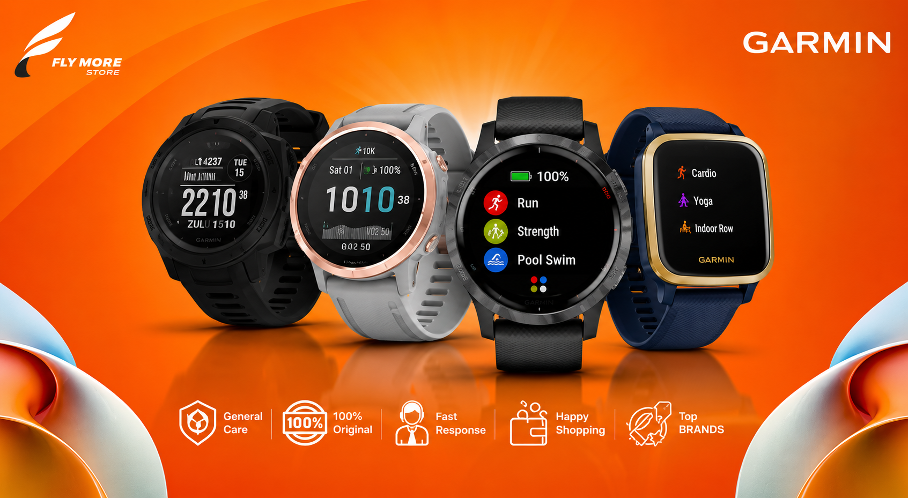

# Trendify 🛍️ — Modern E-Commerce Platform



**Trendify** is a state-of-the-art, high-performance E-Commerce web application built with **React**, **TypeScript**, **Vite**, and **Tailwind CSS**. It delivers a premium shopping experience featuring direct express checkout, real-time cart & wishlist management, interactive order tracking, dark/light theme switching, and a refined brand color design system.

---

## ✨ Features

- 🛍️ **Comprehensive Product Catalog**: Browse products across categories (Headphones, Smartwatches, Backpacks, Gaming Gear, Audio) with flash sales, best-sellers, and new arrivals.
- ⚡ **Direct "Buy Now" Express Checkout**: Instant payment modal bypasses the cart drawer for seamless one-click purchases.
- 🛒 **Dynamic Cart & Order System**: Real-time subtotal/discount calculation, promo code validation, free shipping progress, and active order tracking.
- ❤️ **Synchronized Wishlist**: Reactive wishlist count badge and saved items management synchronized with `localStorage`.
- 🔍 **Search & Category Filtering**: Instant product search bar and multi-level category navigation.
- 🎨 **Curated Color Palette System**: Custom HSL/hex palette (`#000000`, `#1F150C`, `#412D15`, `#E1DCC9`) with dark mode support.
- 🔤 **Typography**: Powered by Google Fonts **Roboto** for high legibility across all devices.
- 📱 **Fully Responsive Layout**: Mobile-first, fluid navigation drawer, responsive grids, and desktop sidebar navigation.

---

## 🛠️ Tech Stack

- **Framework**: React 19 + TypeScript
- **Build Tool**: Vite 6
- **Styling**: Tailwind CSS v4 + Vanilla CSS Design Tokens
- **Icons**: Lucide React (`lucide-react`)
- **State Management**: React Context API (`ShopContext`) with `localStorage` persistence

---

## 🚀 Getting Started

### Prerequisites

Ensure you have **Node.js** (v18 or higher) and **npm** installed on your system.

### Installation

1. **Clone the repository**:
   ```bash
   git clone https://github.com/sharmin-juthi/Trendify.git
   cd Trendify
   ```

2. **Install dependencies**:
   ```bash
   npm install
   ```

3. **Start the development server**:
   ```bash
   npm run dev
   ```
   Open your browser at `http://localhost:5173`.

4. **Build for production**:
   ```bash
   npm run build
   ```

---

## 📂 Project Structure

```text
Trendify/
├── public/                # Static assets (images, logos, banners)
├── src/
│   ├── assets/            # Project media assets
│   ├── components/
│   │   ├── account/       # Orders Tracker Modal
│   │   ├── auth/          # Authentication & Login Modal
│   │   ├── checkout/      # Payment Checkout Modal
│   │   ├── home/          # Hero, Flash Sales, Featured Sections
│   │   ├── layout/        # Header, Footer, Sidebar, Cart Panel
│   │   ├── product/       # Product Card, Product Detail Modal
│   │   └── views/         # Shop, Categories, Wishlist, Cart Pages
│   ├── context/           # ShopContext (Global Application State)
│   ├── data/              # Product & Category Data Sets
│   ├── services/          # Local Storage Persistence API Service
│   ├── types/             # TypeScript Type Definitions
│   ├── App.tsx            # Main Application Component
│   ├── index.css          # Design Tokens & Tailwind Import
│   └── main.tsx           # Entry Point
├── index.html             # Main HTML Template & Google Fonts
├── package.json
└── vite.config.ts
```

---

## 📄 License

This project is licensed under the [MIT License](LICENSE).
